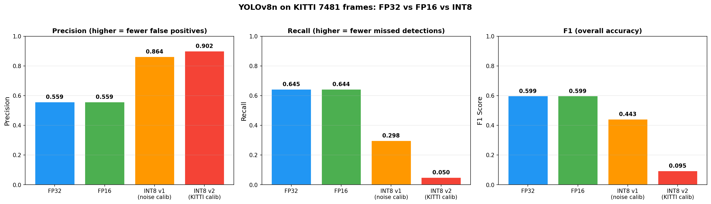
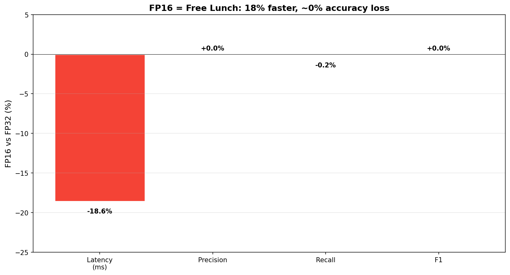
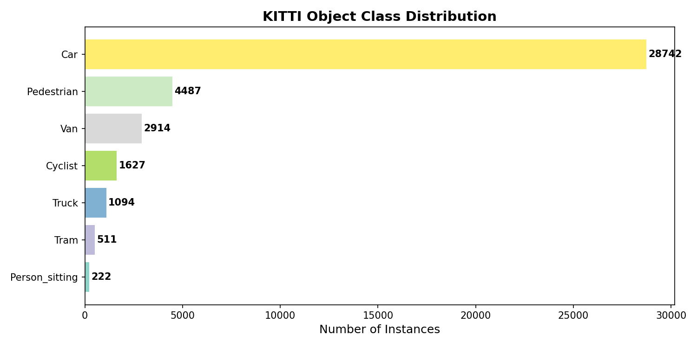
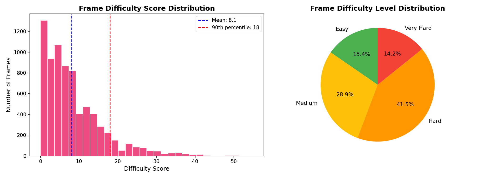
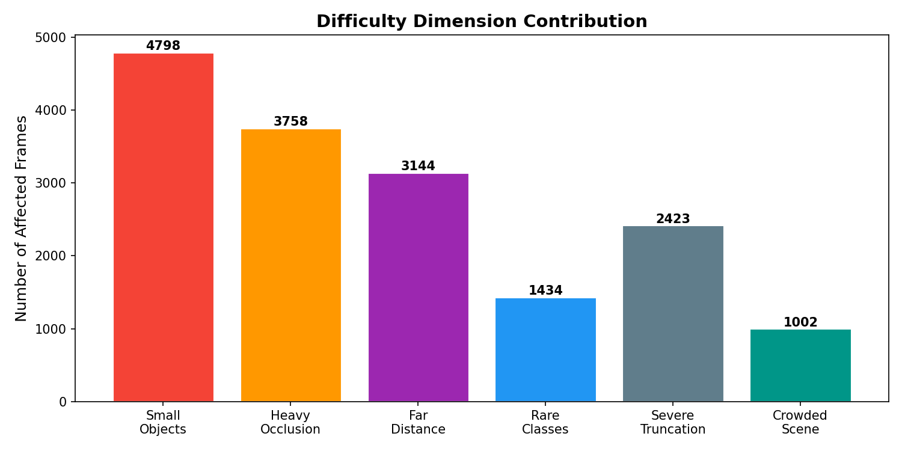
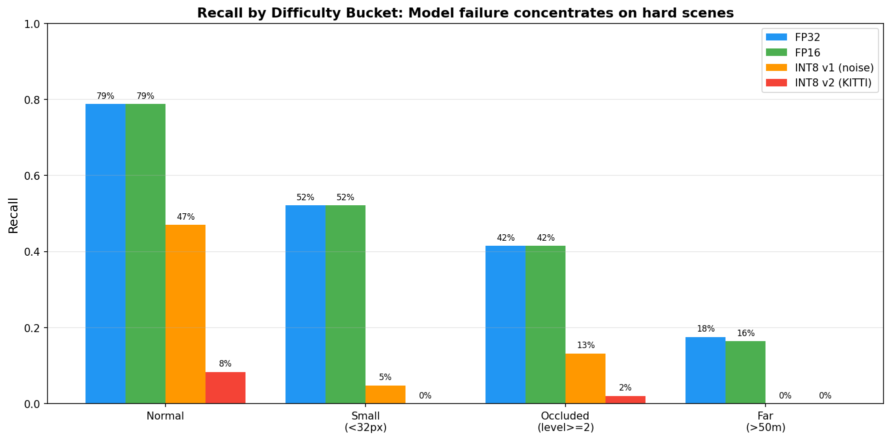

# YOLOv8 TensorRT 部署优化 + KITTI 模型评估闭环

在消费级 GPU (RTX 4060 8GB) 上完成 YOLOv8n 完整部署链路,并在 **KITTI 7481 帧真实驾驶数据**上构建模型评估闭环,系统分析量化精度损失与模型失效场景。

## 项目定位

这个项目把**模型部署**和**算法评估**串成一条完整链路:

```
训练好的模型(.pt) → ONNX → TensorRT engine (FP32/FP16/INT8)
                                    ↓
                       在 KITTI 7481帧真实数据上推理
                                    ↓
                  与真值 IoU 匹配 → 计算 Precision/Recall/F1
                                    ↓
              按难度分桶分析失效模式 (小目标/遮挡/远距离)
```

## 核心成果

### 一、部署链路性能 benchmark

| 精度 | 延迟(ms) | FPS | 加速比 |
|------|----------|-----|--------|
| PyTorch baseline | 6.50 | 153.4 | 基线 |
| TensorRT FP32 | 3.15 | 317.2 | 2.1x |
| TensorRT FP16 | 2.24 | 445.6 | **2.9x** |
| TensorRT INT8 | 2.04 | 491.3 | 3.2x |

### 二、KITTI 全量精度评估(7481 帧)

| 精度 | Precision | Recall | F1 |
|------|-----------|--------|-----|
| TensorRT FP32 | 0.559 | 0.645 | 0.599 |
| TensorRT FP16 | 0.559 | 0.644 | 0.599 |
| TensorRT INT8 v1 (噪声图校准) | 0.864 | 0.298 | 0.443 |
| TensorRT INT8 v2 (KITTI校准) | 0.902 | 0.050 | 0.095 |



**两个关键洞察:**

1. **FP16 = Free Lunch**: 速度+18%, 精度损失 <0.1pp。生产环境无脑用。
2. **INT8 PTQ 在此组合下不可靠**: 验证三种校准方案(无/噪声图/真实数据)全部失败,得出**生产部署需要 QAT(量化感知训练)** 的判断。



### 三、KITTI 数据集分析与难例挖掘

7481 帧 / 39597 标注目标 / 7 类别:

- **类别极度不均衡**: Car 28742 vs Person_sitting 222, 相差 130 倍
- 设计 **6 维难度评分体系**(小目标/遮挡/远距离/稀有类别/截断/密集),自动挖掘 **1062 帧(14.2%)极难场景**
- 最大难度来源: 小目标(影响 64.1% 的帧)







### 四、评估闭环: 数据难度评分 vs 模型实际失效

把"数据预测的难度"和"模型实测的 Recall"对齐,验证评分体系是否真的预测了模型失效:

| 场景类型 | FP16 Recall | 相对 Normal 下降 |
|---------|------------|------------------|
| Normal | 78.8% | 基线 |
| Small (<32px) | 52.1% | -26.7pp |
| Occluded (lv≥2) | 41.5% | -37.3pp |
| Far (>50m) | 16.4% | **-62.4pp** |



**评估闭环成功**: 数据难度评分高度吻合模型真实失效模式 → 可直接对接针对性数据增强和算法改进。

## 关键工程踩坑

完整记录详见 [`docs/troubleshooting.md`](docs/troubleshooting.md)。

1. **NGC 镜像四层依赖地狱**: numpy/opencv 版本冲突,根因是 Python 优先加载镜像预装的系统级 cv2 而非 pip 包
2. **预处理一致性陷阱**: 初版用 `cv2.resize` 直接拉伸 640×640 导致 Pedestrian Recall 从 58.7% 跌到 4.3%,改用 letterbox 修复 → 验证"部署的精度差距可能全部来自预处理细节"
3. **容器网络代理隔离**: 容器流量不走宿主 VPN TUN 隧道,定位方法是对比"GitHub 可下而 ultralytics.com 不可下" → 部署环境应假设网络受限
4. **INT8 PTQ 三次失败的事实记录**: 不掩盖失败,得出真实工程判断

## 技术栈

| 层级 | 工具 |
|------|------|
| 容器 | Docker, NVIDIA Container Toolkit, NGC `pytorch:24.10-py3` |
| 框架 | PyTorch 2.5, Ultralytics 8.4.51 |
| 部署 | TensorRT 10.5, ONNX (opset 17), PyCUDA |
| 数据 | KITTI 2D Object Detection (7481 frames) |
| 评估 | 自实现 IoU 匹配 + 类别映射 + 难度分桶 |
| 硬件 | NVIDIA RTX 4060 (8GB) |

## 项目结构

```
src/
├── 01-08  TensorRT 部署链路 (导出/构建/benchmark/精度验证)
├── 09-10  KITTI 数据集分析 + 难度评分难例挖掘
├── 11-15  KITTI 全量评估 (基础版 + letterbox 修复版 + 三档对比 + INT8重校准)
└── 16     可视化图表生成

docs/troubleshooting.md  工程踩坑记录
outputs/charts/          所有评估对比图表
```

## 复现

```bash
docker run --gpus all -it --rm -v <项目路径>:/workspace --shm-size=8g nvcr.io/nvidia/pytorch:24.10-py3
source /workspace/setup.sh

# 部署链路
python src/03_export_onnx.py
python src/04_build_trt.py
python src/07_full_benchmark.py

# 数据分析
python src/09_kitti_overview.py
python src/10_hard_case_mining.py

# 评估闭环
python src/13_full_evaluation.py
python src/16_final_visualization.py
```
